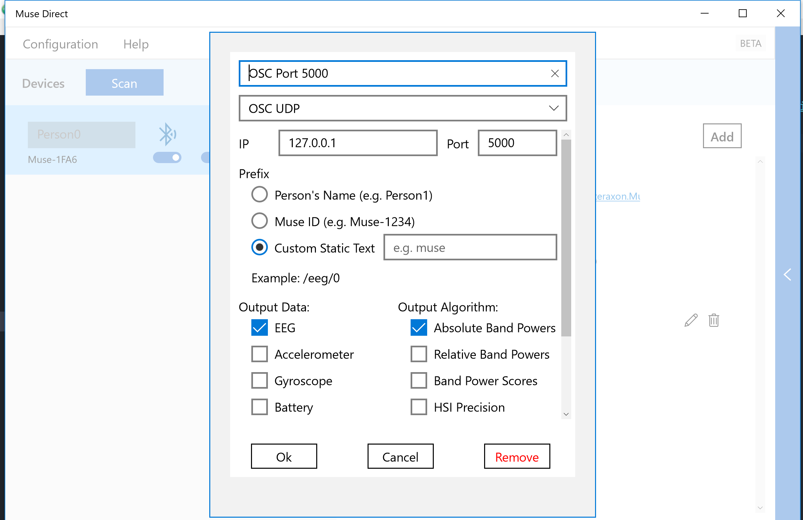
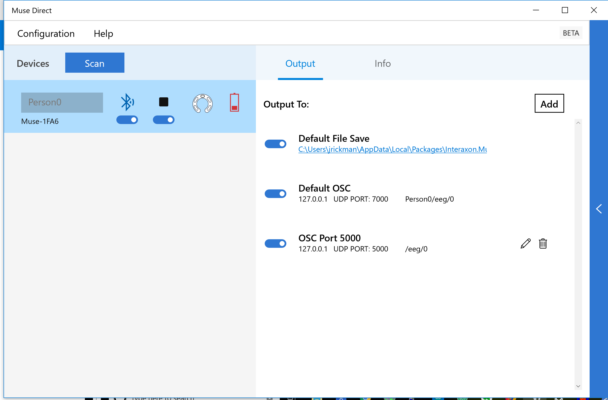

This is a Chrome app that sonifies data from a Muse EEG headband.

We have to use a Chrome app and not a regular page, in order to have UDP access
to receive OSC messages from the Muse software.

To use, you will need [Muse Direct](http://developer.choosemuse.com/tools/windows-tools/musedirect)
installed on your computer, and have your headband paired over bluetooth.
You will then need to add an output to Muse direct that streams to port 5000.
The configuration should look like the below:

</img>

**Note the selection of "custom static text" with a blank input under prefix!**
It turns out that the way Muse Direct formats OSC addresses, e.g. "Person0/eeg",
is NOT standard OSC and the OSC.js library won't accept it, giving an error.
OSC addresses are supposed to start with a leading slash, so by setting up the
configuration this way we get addresses like `/eeg`, which is valid.

In Chrome, turn on developer mode in the Extensions page and load this folder
as an unpacked extension. Then, once you have your Muse connected to Muse Direct
and streaming to port 5000 (should look like the below screenshot), you can
launch the Muse-Tone chrome app from the `chrome://apps` page in your browser.

</img>

Note that Chrome seems to hold its lock on port 5000 even after you close the
Muse-Tone app, and the next time you open the app it will fail because it can't
open the port. You will know its failing if you hear a continuous, unchanging
noise. The fix is to go into the Extensions tab and click the reload button
on the Muse-Tone app.

Note also that only the data from the first contact on the headband is used.
I think this is the center left contact.